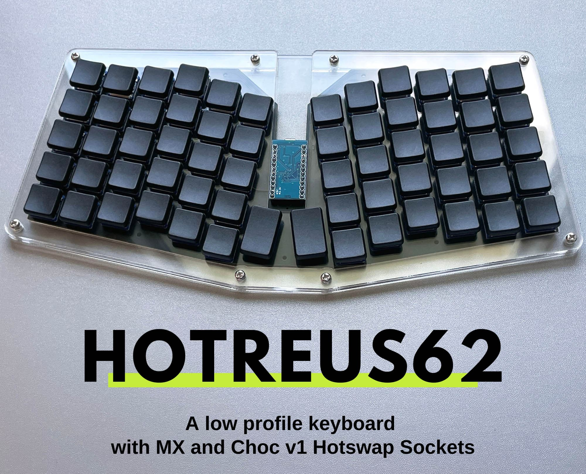

# Hotreus62 Keyboard

The Hotreus62 Keyboard is a fork of [atreus62 keyboard](https://github.com/profet23/atreus62). It supports MX hotswap and Kailh Choc v1 hotswap sockets on the same board, similar to [Lily58 Pro](https://github.com/kata0510/Lily58). The overall keyboard height is reduced, with the breakout board placing on the top.

More photos can be found at the [beekeeb showcase](https://showcase.beekeeb.com/hotreus62-hotswap/). Pre-soldered keyboard PCBs are available at the [beekeeb shop](https://shop.beekeeb.com/product/pre-soldered-hotreus62/).

## Firmware

An example for the Vial firmware can be found at https://github.com/beekeeb/vial-qmk-hotreus62

## Bill of Materials (BOM)

* pro micro or compatible breakout boards
* 62 1N4148 SOD-123 diodes
* 62 hotswap sockets (mx or choc v1)

